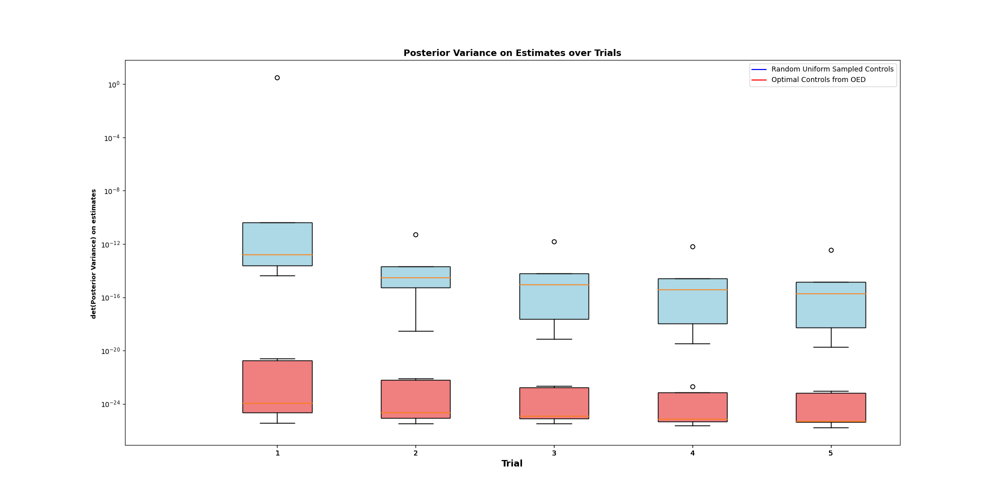

Optimal Experimental Learning on a cartpole system. Finding an optimal set of controls involves maximizing the trace of the fisher information (which is related to the posterior variance via the Cramer Rao bound), subjecto to system dynamics. My goal is to maximize the precision over my estimates of the physical system (mass of cart, mass of pole, length of pole). Set the number of trials and runs in main.py, and also set the simulation run time of your choosing. After data acquisition, run plotBoxWhisker.py to obtain the visual below:

